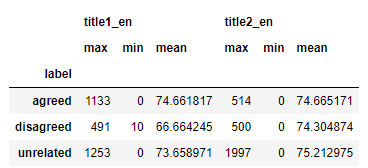
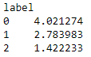
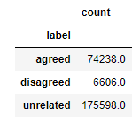
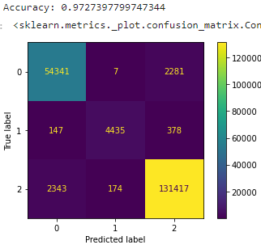
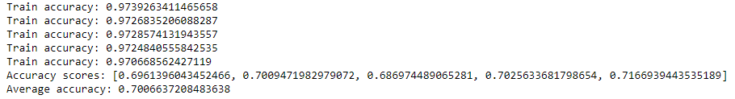
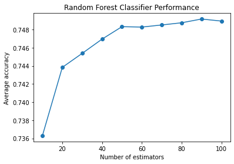
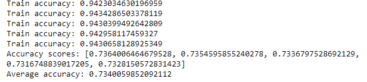
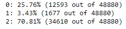
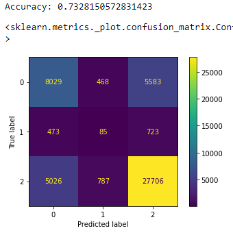

# Fake News Classification

[Justin Panagakis](https://github.com/jpanagakis2309)

[Yousef Suleiman](https://github.com/yojoecapital/)

## Introduction

Combating misinformation in an automated fashion is a difficult task to handle; specifically, determining the relevance of an article in relation to another. Sentiment towards the topic must be converted into a numerical value and the words in each topic must have their correlation numerically represented as well. The program screening these articles must to be able to relate the titles such as "It’s a bad thing that this good thing happened yesterday" and "It’s a good thing this bad thing didn’t happen the other day"; though these titles seem simple to relate, the program must be able to understand double negatives and phrases that are synonymous with each other. Given a dataset of article title pairs where one is known to be fake and the other’s authenticity is unknown, we’re tasked with creating a model that can distinguish between articles that agree, disagree, or are not related with each other.

## Preprocessing

Before we are able to process the data, it must be preprocessed in a way that makes itself meaningful to the program. The data consisted of title pairs labeled as "agree", "disagree", and "unrelated"; and IDs for both the individual titles and pairs of titles. It was assumed that both forms of IDs had no correlation with each other since they would only serve the purpose of identifying specific objects with no significant pattern in hashing. This leaves only the columns holding the title names and labels for each pair. The label column is, of course, for validation purposes while the titles will be used to train the model.

### Cleaning the Data Frame and Text

Before analysis could begin, the data frame had to be pruned of invalid article titles and title pairs. To prune the data frame, all rows with a title with less than 30 alphabetical characters were dropped. This was because many rows had entries with titles that were empty or only consisted of "=" characters, such titles provided little to no analytical value. The limit was decided to be 30 characters based on the analysis of the lengths of alphabetic characters in the training data:

As shown in the above aggregation table, the titles had at least 10 alphabetical characters with an average of about 60 to 70 alphabetical characters. For this reason, 30 characters were chosen as a limit and out of the 256,442 entries in the training data, about 12,000 of them were pruned.

The cleaning process of a title was done in four steps within the preprocess_title function:

1. Converting to lowercase
2. Removing punctuation
3. Removing stopwords
4. Stemming

Converting each title to lowercase ensured the text was consistent; removing punctuation reduced noise since sentence type does not impact relatedness; removing stopwords eliminates article words (such as "the") that don’t provide any meaningful information; and stemming reduces words to their roots to create consistency between verb tenses. This is a demonstration of a text being preprocessed:

`'I am a title of a fake news article..' -> 'titl fake news articl'`

### Measuring Similarity

Similarity between the titles word-wise is a significant feature. Based on analysis of the data, a relatively high similarity score should indicate that the title pair be sorted under the "agree" or "disagree" label while a relatively low similarity score indicates that the title pair be sorted under the "unrelated" label.

 

The figure above depicts the mean value of the number of common words between title pairs grouped by label; where 0 indicates "agreed", 1 indicates "disagreed", and 2 indicates "unrelated." Common word count provides a simple way to quickly measure the similarity between title pairs as the more similar words there are, the more it suggests they are related. As shown, the agreed and disagreed titles tend to share more words than the unrelated title pairs; however, this does not capture the importance or the sentiment of the word choice.

### TF-IDF: Related versus Unrelated Articles

Another approach we took to calculating the similarity between the article titles was to vectorize each title pair by using TF-IDF. Term Frequency-Inverse Document Frequency or TF-IDF is a statistic to represent the importance of words as vectors in a corpus or a group of documents (Borcan, 2020). Given a term *t*, document *d*, and corpus *D*, TF-IDF is calculated as follows:
$$
w_{j,i} = tf_{j,i} \times idf_j \\ \\
idf_j = \log_2 \frac{|D|}{|\{\text{document } \in D|j \in \text{ document}\}|}
$$
TF-IDF for a title pair was returned as two vectors of equal length (equivalent to the cardinality of the union of the set of words in each title). The Cosine similarity between the two vectors was then taken. Cosine similarity was chosen as opposed to Euclidean distance as Cosine similarity measures the similarity of the vector’s direction as opposed to their magnitude. This way, the distances between them are normalized.

### Sentiment Analysis: Agreeing versus Disagreeing Articles

Similarity between titles sentiment-wise is also a significant feature to keep track of. Sentiment is used to differentiate between agreeing and disagreeing articles. Two articles may have very similar TF-IDF vectors while also differing in sentiments. For example, "The POTUS is doing a good job" and "The POTUS is doing a bad job" both only differ by one word and therefore are similar enough to be related; but, TF-IDF does not differentiate between the sentiments given by the words "good" and "bad", but only the frequency of the union of the total words used. In order to remedy this, a sentiment analyzer was used to determine the sentiment values of each article. The idea is that if these sentiments are similar enough within a certain tolerance, it can be determined whether these entries agree or disagree with each other. 

To distill these sentiment values into a singular value, each sentiment vector pair was normalized using cosine distance. Each article fed into the sentiment analyzer returned a sentiment vector containing scores for positivity, negativity, neutrality, and a composite score. Each pair of articles’ sentiment vectors were then normalized using cosine distance. Cosine distance was chosen over euclidean distance after some deliberation. The main reason why cosine distance was chosen was because it only measures the difference in direction, while euclidean distance measures the difference in direction with magnitude in mind. For example, two articles that have an overall negative sentiment will be measured as being more similar using cosine distance rather than euclidean distance regardless of word choice, so long as they both express the same, general sentiment.

## Classification Model

Following preprocessing, the data was split into a ratio of 8:2 for training and testing, respectively. We first trained a logistic regression model to classify the title pairs. The logistic regression model had difficulty in classifying "disagreed" labels as a result of imbalance in data. Only around 2.5% of the training data has the disagreed label.

`{"agreed" : 68.5%, "disagree" : 2.5%, "unrelated" : 29.0%}`

We next trained a neural network with Keras in TensorFlow. It contained 2 layers with the first being a dense layer with a ReLU activation function and the second being a dense output layer with 3 neurons for the 3 class label. It returned a probability distribution of over the three classes. 

An issue arose where the network was not classifying any of the labels as "disagreed". We tried to alleviate this by introducing class weights. The purpose of the class weights was to address the imbalance in the training data by giving more attention to the minority class in the training process (Amy, 2022). However, this resulted in a stark decrease in the classifier’s performance, accuracy, and resulted in the model underfitting the data.

Next, we utilized a simple decision tree using the scikit-learn package and DecisionTreeClassifier. The decision tree did a much better job at fitting the training data and was able to identify "disagreed" articles better than the logistic regression model and neural network. Shown below is the confusion matrix on the training set. It was able to fit on the training set with 97% accuracy.

We also used k-folds validation to lookout for possible overfitting. In k-folds validation, the data is split into k equally sized subsets (Baheti, 2021). If the model has consistent performance across the folds, then it indicates that the model is generalizable. 

Above is the accuracy through each fold. It remains mostly consistent (with some variation) although the validation accuracy could be improved. We decided to use ensemble learning and a random forest to improve accuracy and reduce variance.

First, we needed to come up with hyperparameters for the forest. To do this, we used a grid search across multiple forests while increasing the number of estimators for 10 to 100. These are the resulting accuracies:

As shown, the accuracy of the random forest plateaus at around 50 estimators so this was the parameter we used. We also limited the depth of all the trees to 25 and used "balanced" as the class_weight parameter. Again, we used k-folds validation to avoid overfitting:

The accuracy across each fold is even more consistent than previously and the validation accuracy has improved slightly.

## Results

The final iteration of our model resulted in an accuracy of 73.4% on the validation subset with 48,880 entries with the following composition:

where 0 indicates "agreed", 1 indicates "disagreed", and 2 indicates "unrelated." Of those entries, the agreeing articles were identified correctly 57.02% of the time, the disagreeing articles were identified correctly only 6.64% of the time, and the unrelated articles were correctly identified 82.66% of the time. 

As shown in the confusion matrix, many of the entries are being falsely labeled as "unrelated" and "agreed'' such that there is significant overlap between them. More analysis could be done to identify the overlap. For example, during preprocessing the punctuation was eliminated to remove noise. However, data on the punctuation used could have been an important feature in distinguishing between labels.

Moreover, many of the "disagreed" labels are being falsely classified. Frustratingly, a model can achieve an accuracy of 68% by labeling every entry as "unrelated". Because the accuracy of labeling "agree" entries correctly is 57.02%, it is possible that the model’s decision to classify them as such is no better than a guess. The small proportion of "disagree" entries in the training.csv is a difficult limiting factor to overcome and has no doubt introduced a strong bias to our model. The model sacrifices the gross accuracy it can gain from classifying more entries as "unrelated" for greater accuracy in labeling entries as "agree". To conclude, our model seems to still be overfitted on the training data as its prediction on the validation set has 73% accuracy while it has 94% accuracy on its training set. However, our model is accurate enough to surpass simple guesswork and has shown the impact available training data has on its capability.

------

## References

### Libraries used in Program

- [pandas](https://pandas.pydata.org/docs/user_guide/index.html)
- [nltk](https://www.nltk.org/)
- [scikit-learn](https://scikit-learn.org/stable/user_guide.html)
- [numpy](https://numpy.org/doc/)
- [Ipython](https://ipython.readthedocs.io/en/stable/)

### Tutorials

- [TF-IDF Explained And Python Sklearn Implementation](https://towardsdatascience.com/tf-idf-explained-and-python-sklearn-implementation-b020c5e83275)
- [Text pre-processing: Stop words removal using different libraries](https://towardsdatascience.com/text-pre-processing-stop-words-removal-using-different-libraries-f20bac19929a)
- [How To Use Python pandas dropna() to Drop NA Values from DataFrame](https://www.digitalocean.com/community/tutorials/pandas-dropna-drop-null-na-values-from-dataframe)
- [Stemming Text with NLTK](https://towardsdatascience.com/stemming-corpus-with-nltk-7a6a6d02d3e5)
- [FreqDist with NLTK](https://stackoverflow.com/questions/4634787/freqdist-with-nltk)
- [Decision Tree Classification in Python Tutorial](https://www.datacamp.com/tutorial/decision-tree-classification-python)
- [Neural Network Model Balanced Weight For Imbalanced Classification In Keras](https://medium.com/grabngoinfo/neural-network-model-balanced-weight-for-imbalanced-classification-in-keras-68d7b6c1462c)
- [What is Overfitting in Deep Learning +10 Ways to Avoid It](https://www.v7labs.com/blog/overfitting)
- [Random Forest Classifier using Scikit-learn](https://www.geeksforgeeks.org/random-forest-classifier-using-scikit-learn/#)
